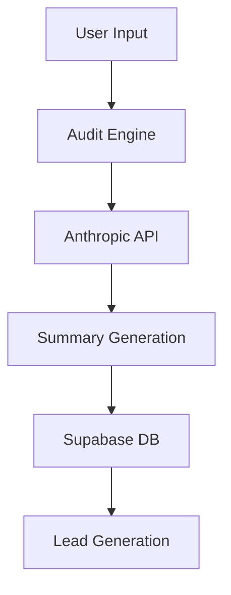

# Architecture

## Data Flow

## Stack Reasoning
- **Framework:** Next.js 14 (App Router) with TypeScript
- **Styling:** Tailwind CSS + shadcn/ui
- **Backend:** Supabase
- **Email:** Resend
- **AI:** Anthropic API (claude-3-5-sonnet-20240620)
- **Deploy:** Vercel

## Scale Section
Currently built for small-to-medium startups. Database structure allows for future expansions to complex multi-org audits.
